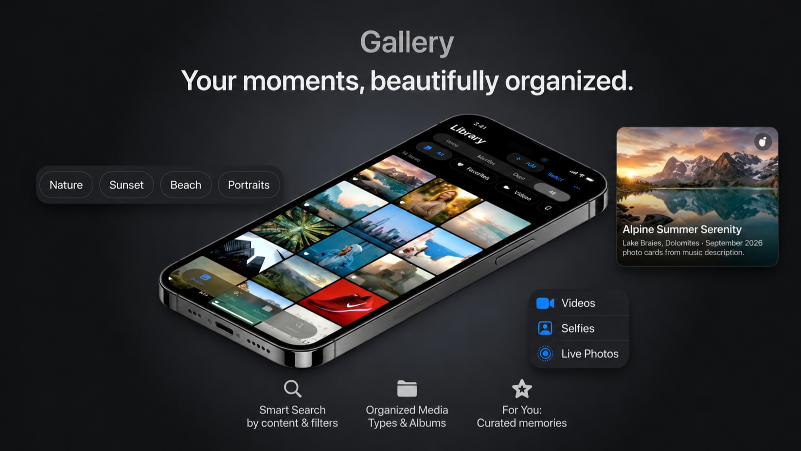

<!-- ================= BANNER ================= -->

  

Photo was generated using Artificial Intelligence. 

<h1 align="center" style="font-size: 124px;">
  Gallery
</h1>

  

A modern, native Android gallery app built with Kotlin and Jetpack Compose.

## Features

- **Photo & Video Browsing** - Grid views with All, Days, Months, and Years grouping
- **Editorial View** - Hero images with grouped thumbnails for a curated feel
- **Albums** - Auto-grouped by folder, with SD card detection
- **Search** - Full-text search across titles, albums, and dates with suggestions
- **For You** - Memory recaps, featured photos, and "On This Day" throwbacks with Ken Burns animation
- **Photo Details** - EXIF metadata viewer (camera, ISO, shutter speed, GPS)
- **Photo Editing** - Exposure, contrast, saturation, warmth adjustments with live preview
- **Selection Mode** - Multi-select with select all, batch delete with system confirmation
- **Favorites** - Mark and filter favorite photos
- **SD Card Support** - Detects and badges media stored on external SD cards
- **Adaptive Icon** - Flower icon with dynamic color theming

Requires Android Studio with AGP 9.1.1+ and JDK 21.

